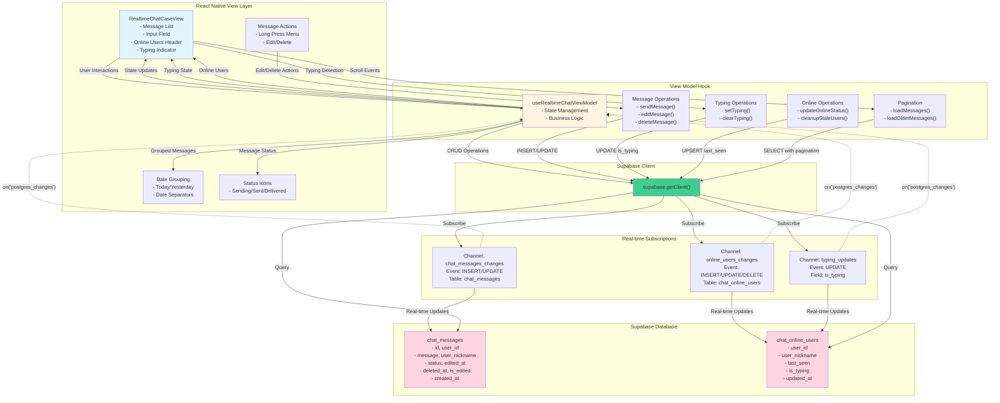

# Enhance Realtime Chat with Essential Features

## Overview

Transform the basic real-time chat into a full-featured chat application by implementing edit/delete, typing indicators, online users, message status, date headers, pagination, and pull-to-refresh.

## Architecture & Data Flow

### Data Flow Details

**1. Message Operations Flow:**

- User types message → `sendMessage()` → INSERT to `chat_messages` with status='sending'
- Real-time subscription detects INSERT → Updates UI with new message
- Status updates: sending → sent → delivered (via UPDATE)

**2. Edit/Delete Flow:**

- Long-press message → Show menu → User selects edit/delete
- Edit: UPDATE `chat_messages` SET `message`, `edited_at`, `is_edited=true`
- Delete: UPDATE `chat_messages` SET `deleted_at=NOW()` (soft delete)
- Real-time subscription detects UPDATE → Updates UI

**3. Typing Indicators Flow:**

- User types in input → Debounce (500ms) → `setTyping(true)` → UPDATE `chat_online_users.is_typing=true`
- After 3s inactivity → `setTyping(false)` → UPDATE `is_typing=false`
- Real-time subscription detects UPDATE → Shows "User is typing..." banner

**4. Online Users Flow:**

- On mount → `updateOnlineStatus()` → UPSERT `chat_online_users` with `last_seen=NOW()`
- Heartbeat every 30s → Update `last_seen`
- Real-time subscription detects INSERT/UPDATE → Updates online users list
- Filter: `last_seen > NOW() - INTERVAL '5 minutes'`

**5. Pagination Flow:**

- User scrolls to top → `onEndReached` → `loadOlderMessages(offset, limit)`
- Query: `SELECT * FROM chat_messages WHERE deleted_at IS NULL ORDER BY created_at DESC LIMIT 20 OFFSET X`
- Append older messages to state
- Track `hasMoreMessages` based on returned count

**6. Pull-to-Refresh Flow:**

- User pulls down → `RefreshControl` → `loadMessages()` → Reload latest messages

## Current State

- Basic real-time messaging (send/receive)
- Simple message bubbles with timestamps
- Database already supports: editing, deletion, online users, typing indicators (via migration `012_enhance_chat_messages_table.sql`)
- UI doesn't utilize any of the enhanced database features

## Implementation Plan

### 1. Update Data Models

**File**: `src/screens/supabase-cases/hooks/use-realtime-chat-view-model.ts`

- Extend `ChatMessage` interface to include: `status`, `edited_at`, `deleted_at`, `is_edited`
- Create `OnlineUser` interface for online users tracking
- Add typing state management

### 2. Enhance View Model Logic

**File**: `src/screens/supabase-cases/hooks/use-realtime-chat-view-model.ts`

- **Message Editing**: Add `editMessage()` function that updates message text and sets `edited_at`, `is_edited`
- **Message Deletion**: Add `deleteMessage()` function that sets `deleted_at` (soft delete)
- **Typing Indicators**: 
  - Add `setTyping()` function to update `chat_online_users.is_typing`
  - Subscribe to typing changes via real-time
  - Auto-clear typing after 3 seconds of inactivity
- **Online Users**: 
  - Add `updateOnlineStatus()` to track user presence in `chat_online_users`
  - Subscribe to online users changes
  - Clean up stale entries on mount
- **Message Status**: Track message status (sending → sent → delivered) when sending messages
- **Pagination**: 
  - Modify `loadMessages()` to support offset/limit for loading older messages
  - Add `loadOlderMessages()` function
  - Track `hasMoreMessages` state
- **Filter Deleted**: Update queries to filter out messages where `deleted_at IS NOT NULL`

### 3. Enhance UI Component

**File**: `src/screens/supabase-cases/components/realtime-chat-case-view.tsx`

- **Message Actions**: 
  - Long-press on own messages to show edit/delete options
  - Edit mode: show inline text input with save/cancel
  - Delete: show confirmation dialog
- **Typing Indicator**: 
  - Show "User is typing..." banner above input when others are typing
  - Debounce typing detection (send typing status after 500ms of typing)
- **Online Users**: 
  - Add header section showing online user count and list
  - Show user avatars/initials
- **Message Status**: 
  - Show status icons (sending spinner, sent checkmark, delivered double-checkmark)
  - Display on sent messages only
- **Date Headers**: 
  - Group messages by date
  - Show date separators (e.g., "Today", "Yesterday", "March 15")
  - Add `groupMessagesByDate()` helper function
- **Pagination**: 
  - Add `onEndReached` handler to FlatList to load older messages
  - Show loading indicator at top when loading older messages
  - Disable when `!hasMoreMessages`
- **Pull to Refresh**: 
  - Add `RefreshControl` to FlatList
  - Refresh reloads latest messages

### 4. Update Styles

**File**: `src/screens/supabase-cases/styles/realtime-chat.styles.ts`

- Add styles for: edit/delete buttons, typing indicator, online users list, message status icons, date headers, loading indicators

### 5. Database Query Updates

- Filter deleted messages: Add `WHERE deleted_at IS NULL` to all queries
- Pagination: Use `order('created_at', { ascending: false }).range(offset, offset + limit - 1)` for reverse chronological loading
- Online users cleanup: Call cleanup function or filter users with `last_seen > NOW() - INTERVAL '5 minutes'`

## Technical Considerations

- Real-time subscriptions: Add separate channels for typing indicators and online users
- Performance: Use `useMemo` for grouped messages, debounce typing updates
- UX: Show optimistic updates for edit/delete (update UI immediately, sync with server)
- Error handling: Show error states for failed operations, allow retry

## Files to Modify

1. `src/screens/supabase-cases/hooks/use-realtime-chat-view-model.ts` - Core logic
2. `src/screens/supabase-cases/components/realtime-chat-case-view.tsx` - UI components
3. `src/screens/supabase-cases/styles/realtime-chat.styles.ts` - Styling

## Database

- Uses existing tables from `012_enhance_chat_messages_table.sql`
- No new migrations needed