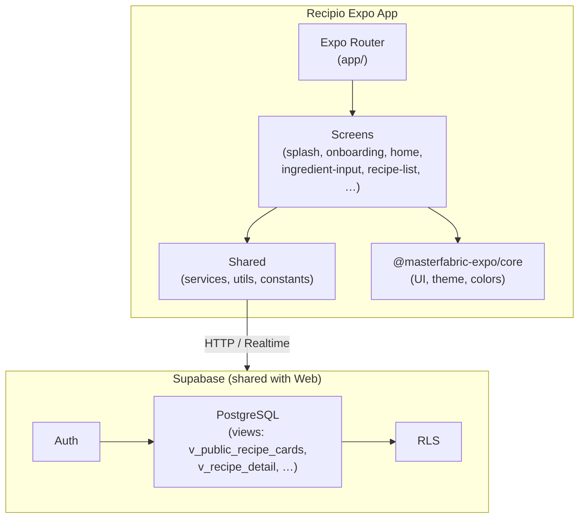
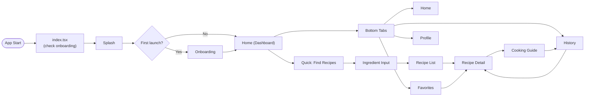

# Recipio — Mobile App Documentation

**Smart recipe suggestions based on the ingredients you have.**  
Recipio is a bilingual (English / Turkish) recipe app with step-by-step cooking guidance, built on the MasterFabric Expo ecosystem and powered by a shared Supabase backend.

---

## Table of Contents

1. [What is Recipio?](#1-what-is-recipio)
2. [Features Overview](#2-features-overview)
3. [System Architecture](#3-system-architecture)
4. [App Flow & Navigation](#4-app-flow--navigation)
5. [Screens at a Glance](#5-screens-at-a-glance)
6. [Technology Stack](#6-technology-stack)
7. [Backend & Data](#7-backend--data)
8. [Development Phases](#8-development-phases)
9. [Getting Started](#9-getting-started)
10. [Documentation Index](#10-documentation-index)
11. [Live Presentation Guide](#11-live-presentation-guide) — Includes [Presentation Script (Turkish)](./presentation-script.md) for spoken paragraphs
12. [Design Reference](#12-design-reference)

---

## 1. What is Recipio?

Recipio is a **minimalist recipe platform** that helps users:

- **Enter ingredients** they have (with quantities and units).
- **Get recipe suggestions** ranked by match (e.g. 100% down), cooking time, and missing ingredients.
- **View recipe details** with **non-linear serving sizes**: 1, 2, 3, or 4 servings can have different ingredient lists (not just scaled).
- **Follow a step-by-step cooking guide** with optional timers and tips.
- **Save favorites**, track **history** (saved/tried), and manage a **profile** (when authenticated).

**User segments:**

| Segment | Capabilities |
|--------|----------------|
| **Anonymous** | Browse free recipes, search/filter, switch language (en/tr). |
| **Authenticated** | All above + favorites, saved, tried, comments, profile. |

**Platform:** The same **Supabase backend** serves both the **Next.js website** and this **Expo mobile app**; schema, views, and RLS are shared.

**Proje konumu:** Recipio uygulaması `project/recipio` altında geliştirilir. Ekstra proje klasörü oluşturulmaz; tüm uygulama kodu bu dizine yazılır.

---

## 2. Features Overview

| # | Feature | Description | Phase |
|---|---------|-------------|-------|
| 1 | **Splash** | App entry; checks onboarding state; short delay then redirect. | 1 ✅ |
| 2 | **Onboarding** | 3-slide intro (Enter Ingredients → Get Matches → Cook); Skip / Get Started; state persisted (Zustand + AsyncStorage). First launch only. | 1 ✅ |
| 3 | **Home** | Greeting, plan card, **Find Your Next Meal** card, Cook Tonight (Supabase), Recent Activity, search icon, bottom tabs. | 1 ✅ |
| 4 | **Enter Ingredients** | Add ingredients; "Find Recipes with These Ingredients…" → recipe results. | 1 |
| 5 | **Recipe Search** | Search by recipe name; recent searches; results list → Recipe Detail. | 1 |
| 6 | **Recipe Detail** | Hero, meta, servings stepper (1–4), ingredients (available/missing), Chef's Tip, Start Cooking; from `v_recipe_detail`. | 1 |
| 7 | **Recipe results** | List of matching recipes (from Enter Ingredients). | 2 |
| 8 | **Cooking Guide** | Step-by-step mode with timer/tip; Previous/Next/Complete. | 2 |
| 9 | **Favorites / History** | Saved and tried recipe lists (tab screens). | 2 |
| 10 | **Profile** | User info, stats, language, theme, sign out. | 3 |
| 11 | **Auth** | Login / Sign up (Supabase Auth); optional, later phase. | 3 |

---

## 3. System Architecture

### High-Level System Architecture

**App-side structure:**

- **`app/`** — Expo Router routes (index, onboarding, (tabs), enter-ingredients, recipe-results, recipe-detail, cooking-guide, (auth)).
- **`src/screens/[view]/`** — Per-screen: `components/`, `hooks/`, `models/`, `store/` (optional), `styles/`, `utils/` (optional), `index.ts`.
- **`src/shared/`** — `services/` (supabase-service, recipe-service, user-service, recipe-search-service), `utils/` (e.g. storage), `constants/`.
- **`src/navigation/`** — Typed navigation (e.g. `RootStackParamList`).

## 4. App Flow & Navigation

User journey and screen relationships:

**Flow summary:**

1. **Entry:** Splash (min delay) → onboarding check → **Onboarding** (first time) or **Home**.
2. **Home:** Dashboard with Find Your Next Meal card, Cook Tonight, Recent Activity; header with search icon; bottom tabs: Home, Favorites, History, Profile.
3. **Recipe flow:** Find Recipes → **Ingredient Input** → **Recipe List** → **Recipe Detail** (servings 1–4) → **Cooking Guide** → back or History.
4. **Tabs:** Favorites and History open **Recipe Detail**; Profile (Phase 3) for settings and auth.

---

## 5. Screens at a Glance

Visual and functional summary for each screen (for demos and live explanation):

| Screen | Purpose | Key UI elements | Data source |
|--------|---------|------------------|-------------|
| **Splash** | Entry, branding | Logo, app name, tagline, loader | Local (onboarding check via AsyncStorage) |
| **Onboarding** | First-time intro | 3 slides, step indicator, Skip / Get Started | Zustand + AsyncStorage |
| **Home** | Main hub | Header (greeting, avatar, search), plan card, Find Your Next Meal card, Cook Tonight carousel, Recent Activity list, bottom tabs | Supabase: recipes, activities, user profile |
| **Ingredient Input** | Add what you have | Search, category filter, ingredient list, Suggest Recipes button | Local state; submit → recipe search |
| **Recipe List** | Matching recipes | Cards with image, title, compatibility %, time, difficulty; sort/filter | `v_public_recipe_cards`, search API |
| **Recipe Detail** | Single recipe | Hero, back/favorite, meta, servings stepper (1–4), ingredients (✓/✗), steps, Start Cooking, nutrition | `v_recipe_detail` |
| **Cooking Guide** | Step-by-step cook | Progress bar, step title/instruction, timer/tip, Previous/Next/Complete | Recipe steps from detail |
| **Favorites** | Saved recipes | List/grid of favorite cards, search, remove | Supabase `favorites` |
| **History** | Past activity | List of saved/tried recipes with date | Supabase (saved/tried, views) |
| **Profile** | User & settings | Avatar, name, stats (recipes, favorites, cooked), language/theme/notifications, Sign out | Supabase `profiles`, auth |
| **Auth** | Login / Sign up | Email/password or OAuth forms | Supabase Auth |

---

## 6. Technology Stack

| Layer | Technology |
|-------|------------|
| **Framework** | Expo SDK 54, React Native 0.81.5 |
| **Language** | TypeScript 5.9 |
| **Navigation** | Expo Router 6.0 |
| **UI / Theme** | @masterfabric-expo/core (ThemedView, ThemedText, Colors) |
| **State** | Zustand 4.4; AsyncStorage for persistence (e.g. onboarding) |
| **Backend** | Supabase (PostgreSQL, Auth, optional Realtime) |
| **Storage** | @react-native-async-storage/async-storage |

---

## 7. Backend & Data

- **Single Supabase project** shared with the Recipio Next.js website (same schema, views, RLS).
- **Key views for the app:**
  - **`v_public_recipe_cards`** — List/cards: title, description, stats, category.
  - **`v_recipe_detail`** — One recipe: translations, steps, all variants (1–4 servings) with ingredients (TR/EN), stats.
  - **`v_recipe_stats`** — Aggregated stats.
- **RLS:** Anonymous can read published + is_free recipes; authenticated users can read published recipes and manage favorites/saved/tried; admin via `user_roles`.
- **Recipe variants:** Servings 1–4 are separate variants (different ingredient lists); UI uses a servings stepper and loads the correct variant from `v_recipe_detail`.

**Config:** `app.json` `extra.supabaseUrl` / `extra.supabaseAnonKey` or `EXPO_PUBLIC_*` env. See [Configuration](./05-getting-started/03-configuration.md).

---

## 8. Development Phases

| Phase | Screens | Status |
|-------|--------|--------|
| **Phase 1** | Splash, Onboarding, Home (Find Your Next Meal, search icon) | ✅ Done |
| **Phase 2** | Ingredient Input, Recipe List, Recipe Detail, Cooking Guide, Favorites, History | Planned |
| **Phase 3** | Profile, Auth (login/signup) | If time allows |

Each screen follows the same folder structure: `components/`, `hooks/`, `models/`, `store/` (optional), `styles/`, `utils/` (optional), `index.ts`. See [Phased Development & View Structure](./02-architecture/phased-development-and-view-structure.md).

---

## 9. Getting Started

1. **Prerequisites** — Node.js, npm/yarn, Expo CLI, iOS/Android environment. See [01-prerequisites](./05-getting-started/01-prerequisites.md).
2. **Install** — Clone, `npm install`, link workspace (e.g. `@masterfabric-expo/core`). See [02-installation](./05-getting-started/02-installation.md).
3. **Configure** — Set Supabase URL and anon key in `app.json` or `.env`. See [03-configuration](./05-getting-started/03-configuration.md).
4. **Run** — `npx expo start` (or run from project root as per workspace setup). See [04-running-the-app](./05-getting-started/04-running-the-app.md).

Full index: [Getting Started](./05-getting-started/index.md).

---

## 10. Documentation Index

| Document | Description |
|----------|-------------|
| [00-implementation-analysis](./00-implementation-analysis.md) | **Start here.** Dual-client setup, product/feature breakdown, Expo architecture, phases, file structure, Supabase usage. |
| [01-features](./01-features/) | Feature docs: all views (Splash, Onboarding, Home, Ingredient Input, Recipe List, Recipe Detail, Cooking Guide, Favorites, History, Profile). |
| [02-architecture](./02-architecture/) | Folder structure, phased development, view structure matrix, naming, path aliases, MasterFabric usage. |
| [03-tech-stack](./03-tech-stack/) | Frameworks, libraries, tools. |
| [04-integrations](./04-integrations/) | Supabase integration, schema, auth, configuration. |
| [05-getting-started](./05-getting-started/) | Prerequisites, installation, configuration, running the app. |
| [06-i18n-translation-keys](./06-i18n-translation-keys.md) | Translation keys and language support (en/tr). |
| [07-figma-design-reference](./07-figma-design-reference.md) | Figma screens, navigation, Recipe UI model, design tokens, implementation checklist. |

---

**Last updated:** 2026-02-10  
**Version:** 1.0.0  
**Status:** Phase 1-2–3 planned.
