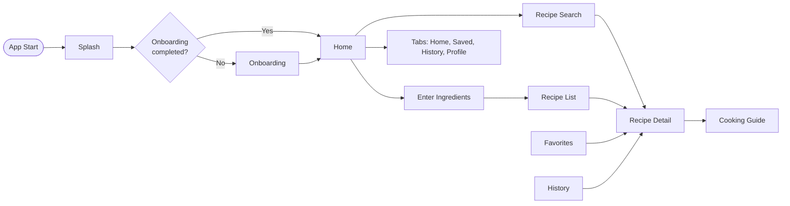
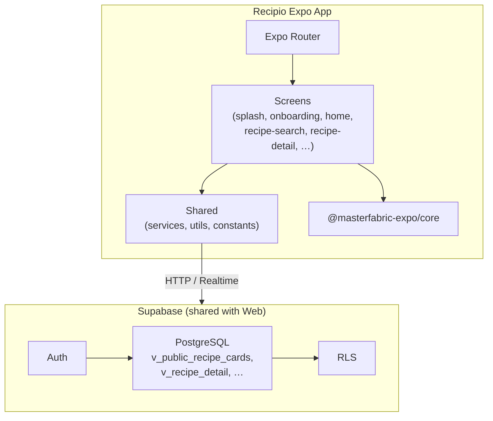

# 🍳 Recipio - Minimalist Recipe Platform

[](https://expo.dev) [](https://supabase.com) [](https://www.typescriptlang.org/) [](https://reactnative.dev/)

**Recipio** is a minimalist, bilingual (Turkish/English) recipe platform with a unique non-linear serving size variant system. This is the **mobile app** (Expo / React Native), sharing the same Supabase backend as the [web version](https://github.com/NurhayatYurtaslan/recipio).

[About](#-about-the-project) • [Features](#-features) • [App Flow](#-app-flow) • [Architecture](#-architecture) • [Design System](#-design-system) • [Tech Stack](#-tech-stack) • [Backend & Data](#-backend--data) • [Development Phases](#-development-phases) • [Getting Started](#-getting-started) • [Documentation](#-documentation)

---

## Table of Contents

- [About the Project](#-about-the-project)
- [Features](#-features)
- [App Flow](#-app-flow)
- [Architecture](#-architecture)
- [Design System](#-design-system)
- [Tech Stack](#-tech-stack)
- [Backend & Data](#-backend--data)
- [Development Phases](#-development-phases)
- [Screen Schematics](#-screen-schematics)
- [Getting Started](#-getting-started)
- [Documentation](#-documentation)

---

## About the Project

Recipio mobile helps users **enter ingredients** they have, **get recipe suggestions** ranked by match and cooking time, **view recipe details** with **non-linear serving sizes** (1–4 servings can have different ingredient lists, not just scaled), **follow a step-by-step cooking guide**, and **save favorites**, track **history**, and manage **profile** when signed in.

### Dual-Client Setup

| Client        | Stack              | Purpose                                                                 |
|---------------|--------------------|--------------------------------------------------------------------------|
| **Website**  | Next.js            | Public and authenticated web experience ([recipio](https://github.com/NurhayatYurtaslan/recipio)) |
| **Mobile App** | Expo (React Native) | Native mobile experience; MasterFabric Expo, `@masterfabric-expo/core`   |

- **Backend:** Single Supabase project (same schema, views, RLS, auth).
- **Data policy:** All data comes **only from Supabase**. Mock or manual test data is never used.
- **Config:** Supabase credentials in `.env`: `EXPO_PUBLIC_SUPABASE_URL`, `EXPO_PUBLIC_SUPABASE_ANON_KEY`.

### User Segment

| Segment           | Capabilities |
|-------------------|--------------|
| **Authenticated** | Browse recipes, search/filter, switch language (en/tr), favorites, saved, tried, comments, profile. |

There is **no anonymous user** in the app. Entry flow: **Splash → Onboarding (first launch only) → Home**. Once onboarding is completed (persisted with Zustand + AsyncStorage), it is not shown again. Profile and auth screens are part of Phase 1 when implemented.

### Project Location

| Item        | Path / Rule |
|-------------|-------------|
| **App root** | All Recipio app code lives under `project/recipio`. |
| **Rule**     | No extra project folders are created; everything stays in `project/recipio`. |

### Core Differentiator: Recipe Variants

- Recipes are **not** linearly scalable: e.g. 2 servings has a **different ingredient list** than 4 servings for the same recipe.
- UI uses a **servings stepper** (1, 2, 3, 4) and loads the correct variant from `v_recipe_detail`.
- Backend: `recipe_variants`, `recipe_variant_ingredients`; app and website use the same Supabase views.

---

## Features

### Feature Overview

| # | Feature | Description | Phase |
|---|---------|-------------|-------|
| 1 | **Splash** | App entry; checks onboarding state; short delay then redirect. | 1  |
| 2 | **Onboarding** | 3-slide intro (Enter Ingredients → Get Matches → Cook); Skip / Get Started; state persisted (Zustand + AsyncStorage). Shown only on first launch. | 3  |
| 3 | **Home** | Greeting, plan card, **Find Your Next Meal** card, Cook Tonight (Supabase), Recent Activity (with **View All** → History), search icon, bottom tabs. | 1  |
| 4 | **Recipe Search** | Search by recipe name; matching recipes from backend; recent searches; results list → Recipe Detail. | 2 |
| 5 | **Cooking Start** | Entry to cooking flow. | 1 |
| 6 | **Recent** | Recent activity / history. | 2 |
| 7 | **Enter Ingredients** | Add ingredients; “Find Recipes with These Ingredients…” → recipe results. | 1 |
| 8 | **Recipe Detail** | Hero, meta, servings stepper (1–4), ingredients (available/missing), steps, Start Cooking, nutrition; from `v_recipe_detail`. | 1 |
| 9 | **Auth** | Login / Sign up (Supabase Auth); form validation via **validator_helper** from `@masterfabric-expo/core`. | 2 |
| 10 | **Profile / Settings** | User info, stats, language, theme, sign out. | 2|
| 11 | **Cooking Guide** | Step-by-step mode with timer/tip. | 2 |
| 12 | **Favorites / History** | Saved and tried recipe lists. |  3|

### Screens at a Glance

| Screen | Purpose | Key UI | Data source |
|--------|---------|--------|-------------|
| **Splash** | Entry, branding | Logo, app name, tagline, loader | Local (onboarding check via AsyncStorage) |
| **Onboarding** | First-time intro | 3 slides, step indicator, Skip / Get Started | Zustand + AsyncStorage |
| **Home** | Main hub | Header (greeting, avatar, search), plan card, Find Your Next Meal, Cook Tonight, Recent Activity + **View All** → History, tabs | Supabase: recipes, activities, user profile |
| **Recipe Search** | Search by name | Search bar, recent searches, recipe cards list | `v_public_recipe_cards`, recipe_translations |
| **Enter Ingredients** | Add pantry items | Input, tag list, “Find Recipes with These Ingredients…” CTA | Local state; submit → recipe search |
| **Recipe Detail** | Single recipe | Hero, back/favorite, meta, servings stepper (1–4), ingredients (✓/✗), steps, Start Cooking, nutrition | `v_recipe_detail` |
| **Cooking Guide** | Step-by-step cook | Progress, step content, timer/tip, Previous/Next/Complete | Recipe steps from detail |
| **Favorites / History** | Saved and tried | List/grid of cards | Supabase `favorites`, saved/tried |
| **Profile** | User & settings | Avatar, name, stats, language/theme/notifications, Sign out | Supabase `profiles`, auth |
| **Auth** | Login / Sign up | Email/password forms (validator_helper) | Supabase Auth |

---

## App Flow

### Entry Flow

| Launch type | Flow |
|-------------|------|
| **First launch** | Splash (min delay) → **Onboarding** (3 slides) → on completion → **Home**. |
| **Subsequent** | Splash → onboarding already completed → **Home** (onboarding skipped). |

### Navigation Diagram



### Route → Screen Mapping

| Route | Screen | Trigger |
|-------|--------|---------|
| `/` (index) | Splash then Onboarding or Home | App start |
| `/onboarding` | Onboarding (3 slides) | First launch |
| `/(tabs)/` | Home (tabs: Home, Saved, History, Profile) | After onboarding / from tabs |
| **Recent Activity "View All"** (on Home) | History tab/screen | From Home → Recent Activity section |
| `/enter-ingredients` | Enter Ingredients | “Find Your Next Meal” card tap |
| `/recipe-search` | Recipe Search | Search icon in header |
| `/recipe-results` | Recipe list (from ingredients) | After “Find Recipes with These Ingredients…” |
| `/recipe-detail/[id]` | Recipe Detail | Recipe card tap (any list) |
| `/(auth)/login`, `/(auth)/signup` | Auth | Sign in / Sign up |

---

## Architecture

### High-Level System Architecture



### App-Side Structure

| Layer | Path | Contents |
|-------|------|----------|
| **Routes** | `app/` | Expo Router: index, onboarding, (tabs), enter-ingredients, recipe-search, recipe-results, recipe-detail/[id], (auth). |
| **Screens** | `src/screens/[view]/` | Per-screen: components, hooks, models, store (optional), styles, index. |
| **Shared** | `src/shared/` | services (Supabase, recipe, user, recipe-search), utils, constants. |
| **Navigation** | `src/navigation/` | Typed navigation (e.g. `RootStackParamList`). |

### Expo Router Structure (Phase 1)

```
app/
├── _layout.tsx              # Root layout (ThemeProvider + Stack)
├── index.tsx                # Entry; redirects to onboarding or home
├── onboarding.tsx
├── enter-ingredients.tsx    # Find Your Next Meal flow
├── recipe-search.tsx        # Search by recipe name
├── recipe-results.tsx       # Recipe list from ingredients
├── recipe-detail/
│   └── [id].tsx             # Recipe Detail
├── (tabs)/
│   ├── _layout.tsx
│   ├── index.tsx             # Home
│   ├── favorites.tsx
│   ├── history.tsx
│   └── profile.tsx
└── (auth)/                  # login, signup (optional)
```

### State Management

| Area | Approach |
|------|----------|
| **Splash** | Local state only. |
| **Onboarding** | Zustand store with AsyncStorage persistence. |
| **Home** | Local state + Supabase in view-model hook. |
| **Server state** | Direct Supabase client (same RLS as website). |

### MasterFabric Helpers (Key for Recipio)

| Helper | Use when |
|--------|----------|
| **validator_helper** | **Auth screens**: email, password validation (`validateEmail`, `validateField`, `ValidatorType`). |
| **time_helper** | Recipe prep time (“25 Mins”), Recent Activity timestamps (`formatDuration`, `fromNow`). |
| **string_helper** | Truncate recipe title/description (`truncate`, `capitalize`). |
| **snackbar_helper** | “Ingredient added”, “Recipe saved”, “Clear all” undo. |
| **connectivity** | Check network before API calls. |

---

## Design System

All screens use the **same color theme**. Dark theme is implemented first; light theme later.

### Color Tokens

| Token | Hex | Usage |
|-------|-----|--------|
| **primary-accent** | `#FF5722` | Main accent: tabs (active), icons, CTAs, buttons, badges, progress |
| **orange** | `#FF9800` | Sparingly: shadows, subtle highlights |
| **light-orange** | `#FFB74D` | Sparingly: softer shadows, glow |

### Theme by Mode

| Mode | Background | Primary Accent | Text | Secondary Text |
|------|------------|----------------|------|----------------|
| **Dark** | `#000000` | `#FF5722` | `#FFFFFF` | `#8E8E93` |
| **Light** | `#FFFFFF` | `#FF5722` | `#000000` | `#8E8E93` |

### Surfaces & Borders

| Element | Dark | Light |
|--------|------|--------|
| **Card/surface** | `#1C1C1E` | `#F2F2F7` |
| **Border** | `#38383A` | `#E5E5E5` |

**Recipio constants:** `src/shared/constants/recipio-colors.ts` — `RecipioColors.primaryAccent`, `RecipioColors.orange`, `RecipioColors.lightOrange`. Prefer `primaryAccent` for all interactive elements.

### i18n

Bilingual app: **English** and **Turkish**. All UI strings use translation keys (see [06-i18n-translation-keys](./06-i18n-translation-keys.md)).

---

## Tech Stack

| Layer | Technology |
|-------|------------|
| **Framework** | Expo SDK 54, React Native 0.81 |
| **Language** | TypeScript 5.9 |
| **Navigation** | Expo Router 6.0 |
| **UI / Theme** | @masterfabric-expo/core (ThemedView, ThemedText, Recipio dark theme) |
| **State** | Zustand 4.4; AsyncStorage (onboarding persistence) |
| **Backend** | Supabase (PostgreSQL, Auth; same as [Recipio web](https://github.com/NurhayatYurtaslan/recipio)) |
| **Validation** | validator_helper (email, password) for auth screens |
| **Storage** | @react-native-async-storage/async-storage |

---

## Backend & Data

Single Supabase project shared with the Recipio Next.js website (same schema, views, RLS).

### Key Views for the App

| View | Purpose | Used by |
|------|---------|---------|
| **v_public_recipe_cards** | List/cards: title, description, stats, category | Home, Recipe List, Recipe Search |
| **v_recipe_detail** | One recipe: translations, steps, all variants (1–4 servings) with ingredients (TR/EN), stats | Recipe Detail |
| **v_recipe_stats** | Aggregated stats | Stats display |

### RLS (Row Level Security) Summary

| Role | Permissions |
|------|-------------|
| **Anonymous** | Read published + is_free recipes; insert views. |
| **Authenticated** | Read all published recipes; manage own favorites/saved/tried, profile, comments. |

### Config

| Variable | Description |
|----------|-------------|
| `EXPO_PUBLIC_SUPABASE_URL` | Supabase project URL (e.g. `https://xxx.supabase.co` or `http://127.0.0.1:54321` for local). |
| `EXPO_PUBLIC_SUPABASE_ANON_KEY` | Supabase anon key. |

Set in `.env` or `app.json` `extra`. See [03-configuration](./05-getting-started/03-configuration.md).

---

## Development Phases

Phases are ordered so that **Phase 1** delivers the core flow (entry → home → search/recipe detail), and **Phase 2** adds full recipe flow, tabs, and polish.

### Phase 1 — Core entry & discovery (in progress)

| # | Item | Description | Status |
|---|------|-------------|--------|
| **1.1** | Splash | App entry; onboarding check; redirect to Onboarding or Home | ✅ |
| **1.2** | Onboarding | 3 slides; Zustand + AsyncStorage; first launch only | ✅ |
| **1.3** | Home (Dashboard) | Header, plan card, Find Your Next Meal, Cook Tonight, Recent Activity + View All → History, tabs | ✅ |
| **1.4** | Recipe Search | Search by name; matching recipes; recent searches; → Recipe Detail | ⏳ |
| **1.5** | Enter Ingredients | "Find Your Next Meal" → add ingredients; CTA → recipe results | ⏳ |
| **1.6** | Recipe Detail | Hero, meta, servings (1–4), ingredients (available/missing), Chef's Tip, Start Cooking | ⏳ |
| **1.7** | Cooking Start | Entry to cooking flow from Recipe Detail | ⏳ |
| **1.8** | Recent Activity | List on Home; **View All** → History tab/screen | ⏳ |
| **1.9** | Auth | Login / Sign up; **validator_helper** for email/password validation | ⏳ |
| **1.10** | Profile / Settings | User info, language, theme, sign out (if time in Phase 1) | ⏳ |

**Phase 1 navigation:** Find Your Next Meal → `/enter-ingredients`; Search icon → `/recipe-search`; Recipe card → `/recipe-detail/[id]`; Recent Activity View All → History tab.

### Phase 2 — Full recipe flow & tabs (planned)

| # | Item | Description | Status |
|---|------|-------------|--------|
| **2.1** | Recipe results | List of matching recipes from Enter Ingredients flow | Planned |
| **2.2** | Cooking Guide | Step-by-step mode with timer/tip; Previous/Next/Complete | Planned |
| **2.3** | Favorites tab | Full Favorites screen (list, remove) | Planned |
| **2.4** | History tab | Full History screen (saved/tried); already reachable via Home "View All" | Planned |
| **2.5** | Profile (full) | Full profile/settings if not done in Phase 1 | Planned |
| **2.6** | Protected routes | Auth-guarded routes where needed | Planned |

---

## Screen Schematics

### Splash

```
+-----------------------------------------------------+
|                     [App Logo]                       |
|                     Recipio                          |
|        "Find recipes based on your ingredients"       |
|                   (Loading...)                       |
+-----------------------------------------------------+
```

- Dark theme: black background, white text, orange accent.

### Onboarding (3 slides)

| Slide | Title | Button |
|-------|--------|--------|
| 1 | Enter Your Ingredients | Next |
| 2 | Get Perfect Recipe Matches | Next |
| 3 | Cook with Confidence | Get Started |

```
+-----------------------------------------------------+
|                                    [Skip]           |
|              [Central Illustration]                 |
|              "Slide Title"                          |
|    Description text.                                |
|              [●] [○] [○]                            |
|              [  Next / Get Started  ]               |
+-----------------------------------------------------+
```

### Home

- **Header:** Avatar, greeting (e.g. GOOD MORNING), “Welcome, {name}!”, search icon.
- **Current Plan card:** Plan name, progress (e.g. 45/50), “Active”.
- **Find Your Next Meal card:** Spoon/fork icon, title, subtitle, chevron → Enter Ingredients.
- **Cook Tonight:** Horizontal scroll of recipe cards (image, title, time, difficulty).
- **Recent Activity:** Saved/finished items with thumbnails and time; **View All** (right) navigates to **History** screen (same as History tab).
- **Tabs:** Home, Saved, History, Profile.

### Recipe Detail

- **Header:** “Recipe Detail”; back, favorite over hero image.
- **Content:** Title, meta (rating, time, difficulty), description, nutrition cards, ingredients (Available/Missing), Chef’s Tip, servings stepper (1–4), Start Cooking.

### Enter Ingredients

- **Header:** Back, “Enter Ingredients”, “Clear All”.
- **Body:** “Add items to your pantry”; input + “Add”; “YOUR INGREDIENTS (N)” as tags; full-width CTA “Find Recipes with These Ingredients…”.

### Recipe Search

- **Header:** Back, “Search Recipes”.
- **Body:** Search bar; “RECENT SEARCHES” + Clear All; “SEARCH RESULTS” as vertical list of recipe cards (image, title, tags).

---

## Getting Started

### Prerequisites

| Requirement | Notes |
|-------------|--------|
| Node.js | 18+ |
| npm or yarn | Package manager |
| Expo CLI | Development and run |
| iOS/Android | Simulator/emulator or device |

See [01-prerequisites](./05-getting-started/01-prerequisites.md).

### Steps

| Step | Action | Doc |
|------|--------|-----|
| 1 | Install dependencies; ensure `@masterfabric-expo/core` is linked | [02-installation](./05-getting-started/02-installation.md) |
| 2 | Set `EXPO_PUBLIC_SUPABASE_URL` and `EXPO_PUBLIC_SUPABASE_ANON_KEY` in `.env` or `app.json` | [03-configuration](./05-getting-started/03-configuration.md) |
| 3 | From `project/recipio`: `npx expo start` | [04-running-the-app](./05-getting-started/04-running-the-app.md) |

Full index: [Getting Started](./05-getting-started/index.md).

---

## Documentation

| Document | Description |
|----------|-------------|
| [00-implementation-analysis](./00-implementation-analysis.md) | **Start here.** Entry flow, Phase 1 scope, auth (validator_helper), file structure, Supabase, screen schematics. |
| [01-features](./01-features/) | Views: Splash, Onboarding, Home, Recipe Search, Recipe Detail, Cooking Guide, Favorites, History, Profile. |
| [02-architecture](./02-architecture/) | Folder structure, naming, path aliases, MasterFabric usage. |
| [03-tech-stack](./03-tech-stack/) | Frameworks and libraries. |
| [04-integrations](./04-integrations/) | Supabase integration and configuration. |
| [05-getting-started](./05-getting-started/) | Prerequisites, installation, configuration, running the app. |
| [06-i18n-translation-keys](./06-i18n-translation-keys.md) | Translation keys (en/tr). |

---

**Last updated:** 2026-02-12  
**Version:** 1.2.0  
**Status:** Phase 1 in progress.
